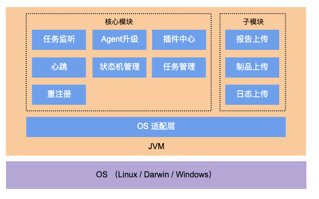

# Baidu BCE 效率云iPipe Agent客户端

## 项目简介
效率云iPipe Agent是效率云高性能、高效率的任务调度执行引擎的客户端。核心能力是管理宿主机器资源，接受CICD任务并在宿主上执行。

### 主要功能
- 任务监听：监听服务端上的任务
- 任务执行：执行服务端分配的脚本任务
- 心跳：检查Agent进程是否存活，并上报自身状态
- Agent升级：自动升级
- 重注册：因网络原因agent掉线， 重新注册
- 报告上传：上传任务结束之后产生的报告
- 制品上传：上传任务结束之后产生的制品
- 日志上传：上传任务执行过程中产生的日志

### 环境要求
jdk, maven

### 兼容性
需兼容jdk1.8及以上，maven3.2及以上版本

### 启动
1. agent-core下执行mvn package生成agent.jar
2. 启动命令：```java -jar -s https://${domain} -t ${agent_uuid}```，其中agent_uuid是配置agent时候自动生成的唯一标示，可以对比资源管理页面的启动命令-t参数查到
3. 或者直接在IDE中启动，主类为：com.baidu.agile.agent.Main

## 整体结构

- 核心模块：该模块的主要功能是对任务监听、管理， 心跳检查、状态机管理、插件中心等
- 子模块：包含一些功能模块， 支持报告、日志、制品的上传等

## 包结构
```
agent
|—— agent-core       # agent核心工具
|   |—— classload      # 类加载工具
|   |—— common         # 公共类
|   |—— context        # agent执行上下文
|   |—— execute        # 任务执行
|   |—— heart          # 心跳检查
|   |—— hook           # 任务执行后hook
|   |—— java           # java信息工具
|   |—— jna            # GNU C library
|   |—— job            # 任务管理
|   |—— log            # 日志处理及上传等
|   |—— os             # 各操作系统适配
|   |—— plugin         # 插件中心
|   |—— process        # 进程管理
|   |—— register       # 任务注册
|   |—— run            # 任务获取
|   |—— upgrade        # 自动更新
|   |—— wrapper        # 任务执行前后环境准备
|   |—— Main           # 启动函数
|—— README.md         
|—— build.sh
|—— LICENSE      
```

## 测试
1. 单元测试用例统一维护在src/test/main目录，```mvn test```执行单测，```mvn cobertura:cobertura```可执行测试并出覆盖率结果报告；

## 如何贡献
1. 代码库中agent-core目录为主程序，内置执行shell任务能力
2. agent-core必须再本代码库开发，扩展任务能力插件建议放在本代码库独立子目录开发

